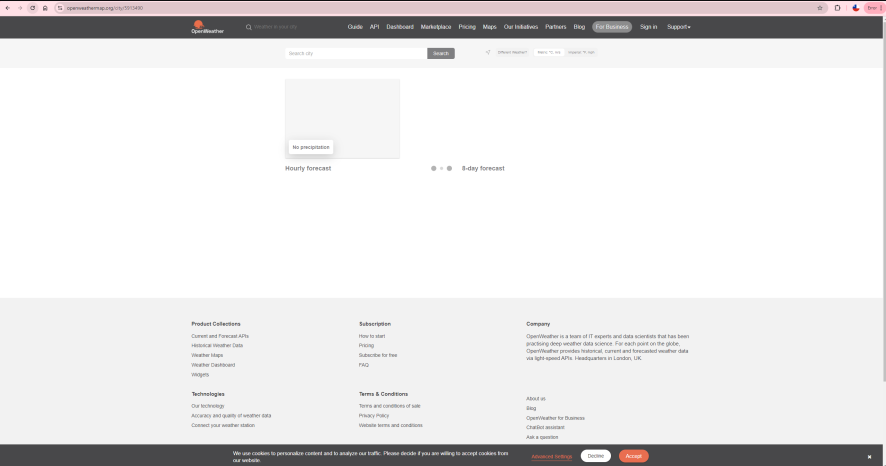
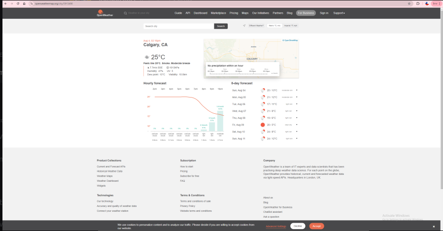

# ENSF380_FinalProject

## Setting up the database

Before you run the project, you must make sure that you have a MySQL database already instantiated.
You can do this by either using DBeaver or MySQL workbench and running the following lines of queries:

CREATE DATABASE IF NOT EXISTS advertisements;

USE advertisements;

CREATE TABLE IF NOT EXISTS ads (
    name VARCHAR(255),
    type VARCHAR(255),
    data LONGBLOB
);

Afterwards, please use the AdvertisementInserter class, and replace all the commented locations with
the required information (user, password, name of ad, filetype extension, path to advertisement). Then run the program as a Java application.

Keep doing this until you have no more ads left to add. The recommended size for the ads is 750 x 400 (on a regular laptop monitor). This ensures that the frame doesn't look scuffed and all the text appers properly. There is a folder filled with ads called "Advertisements" that I have already pre-made, so that you can run the application with properly sized ads.

## Cloning the project

To clone the project simply just use the https link in the github repo and clone it wherever you like. Afterwards, create a Java Project in Eclipse at the same location you cloned it. Eclipse is preferred because all the code was written and worked in Eclipse. 

## Adding the jar files

**Note: This is how you do it in Eclipse**

There are many external libraries that I used to help do stuff like TTS, database management and HTML extraction. To use these libraries, I added a few jars to the build path of the Java Project. 

There is a folder called "Jars" with all of the jars required for this project, please right click on your Java Project and press Build Path --> Congifure Build Path. This will bring you a popup window, and from there click on Classpath, and then press Add External JARS. This will open up your file explorer, and from there all you have to do is locate the "Jars" folder and add all the jars to your build path.

Also remember to add the JUnit 5 library by instead of pressing Add External Jars, you press add Library and then click JUnit.

## Things to note

Firstly, when running the program, a warning always shows up that says
"WARNING: Unable to find an exact match for CDP version..."
I am fairly certain that I downloaded the latest version, but am not entirely sure. Nevertheless, the program runs comepletely fine even with the warning.

Secondly, after doing some random testing; I think that openweather.org is a bit of a slow website, so sometimes the webpage will look like the following for a while 

This will cause an error because I think it can't load or find the HTML code that has the temperature in it, because nothing has been displayed yet. The fix is simple, just go to the website for the city you want to get the weather for and wait for the page to load, so then you know for sure that the program can load and actually get the weather that it needs. It should look like this 

Furthermore, Google Chrome must be installed to run the program, since it uses chrome to actually fetch the data that needed from the website.

## Running the program

Before running the program, there is one last thing that needs to be done. Right click on the Application class in your Java Project and then click Run As --> Run Configurations. This will bring up another menu, go on to the Arguments tab to set up the arguments as follows:

username to the database, password to the database, news topic, city code, train that you want to follow

* commas added for clarity on argument topics, no commas are actually need in the argument section, just 4 words with spaces between them relating to those topics.
* An example of a input is:
* root myP4ssw0rd Calgary 5913490 T01

This allows you to log in to the database without having to manually modify the code to type in your username and password, as well as let you choose the topic of what type of news you want displayed, as well as which city we are getting our weather from.

Now for the easiest part. Simply go to the class called "Application," and run it as a Java Application (remembering that you might have to wait a bit for the weather to load). Then you should be able to see the subway screen in action, fully functional in every which way.
